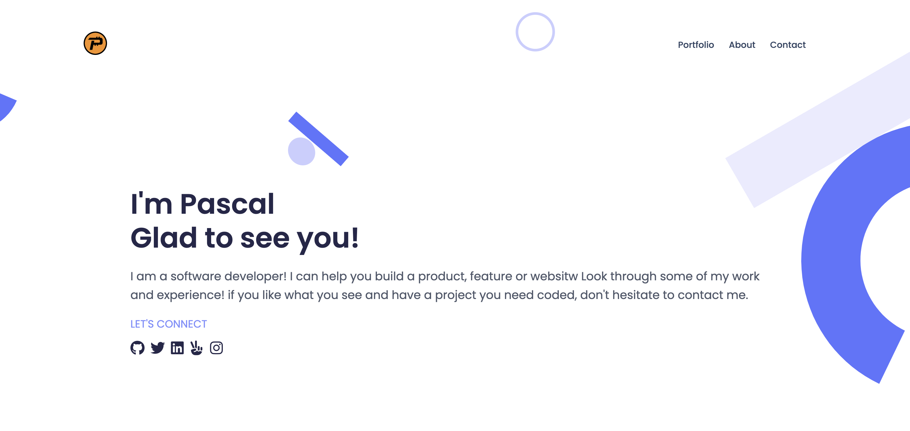
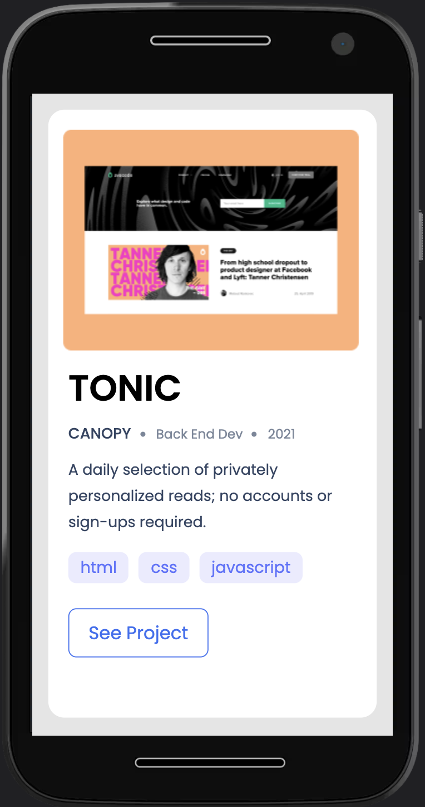

# Responsive portfolio design

# Using flexbox, grid, media Queries, ...

> Simple design of mobile-porfolio-skeleton
> Desktop version
> !

> Simple design of mobile-porfolio-skeleton
> Mobile phone view on Motorola G4

!

## Built With

- Html and Css
- Figma for bette design
  . fiew figma design: (https://www.figma.com/file/l7SqJ3ZfkAKih9sFxvWSR4/Microverse-Student-Project-1?node-id=39%3A122)

## Getting Started

Getting localy a copy of this project you should be aware of several steps below:

1. ### Prerequisites

Make sure:

- You have few knowledge about Html, Css, flexbox, media queries, grid, Github and Linters
- You have installed Live Server to view the project in the browser.

### Usage

1. Use this link ( `git@github.com:KABIKA681/porfolio-part2-flexbox-and-grid.git`)to clone the repository and then run it into your computer
2. Open the Html document localy(into your computer), open index.html file.

👤 **\*Pascal Kabika Mp**

- GitHub: [KABIKA681](https://github.com/KABIKA681?tab=overview&from=2021-12-01&to=2021-12-31)
- LinkedIn: (https://www.linkedin.com/in/pascal-kabika-443061220/)

## Show your support

Give a ⭐️ if you like this project!

## Acknowledgments

- Hat tip to anyone whose code was used
- Inspiration
- etc

## 📝 License

This project is [MIT](./MIT.md) licensed.
